# INXerToolの導入方法と使い方

## 初めに
本ツールは、soutenがINXの価格が気になって気になって仕方がない欲求を少しでも早く満たすために趣味で開発しました。INXerの同志達が少しでも快適なHodler生活の助けになればと思い公開します。

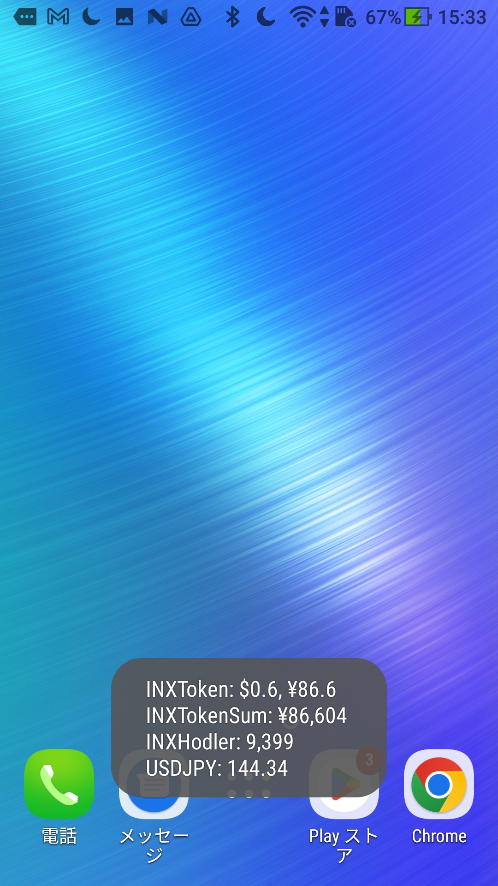

## 注意事項
- 本ツールの利用については、完全自己責任でお願いします。
- 本ツールの利用によって生じたいかなる損害も責任を負いません。
- 導入のハードルが少し高いですが、質問をする前に必ず本ページを熟読してください。
- あくまで"趣味"の範囲ですので、必ずしもすべての質問に答えられるわけではありません。
- クレームや問題が発生した場合は、即公開を停止します。
- INXトークン価格は実行タイミングによっては最新価格でない場合があります。
  ※公式のAPIが出たら更新する予定です。

>最新価格でない場合があるのは、価格情報取得用の機能がINX側で準備されていないため、やむおえず https://www.inx.co/inx-token での価格を参照しているためです。どなたか、QPythonで動的サイト(https://one.inx.co/trading/INX-USD)が読める方法をご存じであれば教えて頂けると幸いです。

## 動作確認環境
- Android OS 7.1.1 (Zenfone3 Lazer)

  ※これ以外の機器で動作確認はできていませんので、利用できたOSのバージョンをTwitterのリプライ等で教えてもらえると嬉しいです。

## 利用するソフトウェア
- QPython 3L (Google play store)

  ※AndroidでPythonコードを実行できる環境が無料で整う素晴らしいソフトです。いろいろ試した中でも、"無料", "ホーム画面にショートカットを置ける"という点で十分な機能を持っているので、利用させて頂きました。

## 導入が必要なプラグイン
- requests : webサイトからのデータ取得用
- beautifulsoup4 : webデータの構文解析用

## 導入方法
　1~5のステップに沿って導入してください。
### 1. QPython 3Lのダウンロード
["QPython 3L" GooglePlayStoreへのリンク](https://play.google.com/store/apps/details?id=org.qpython.qpy3)

### 2. プラグイン導入
QPython 3Lのメイン画面にて、

①QPYPIボタンを押しQPYPIの画面を表示させる。

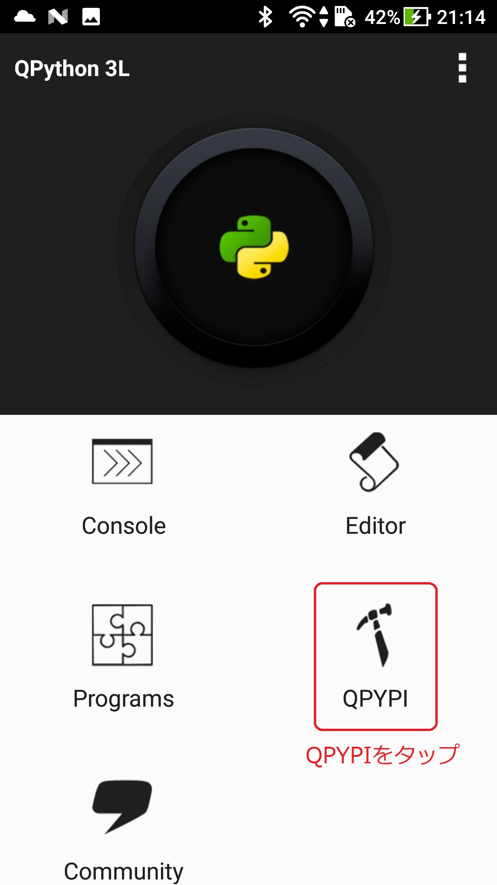

②"Install with official pypi"をタップする。

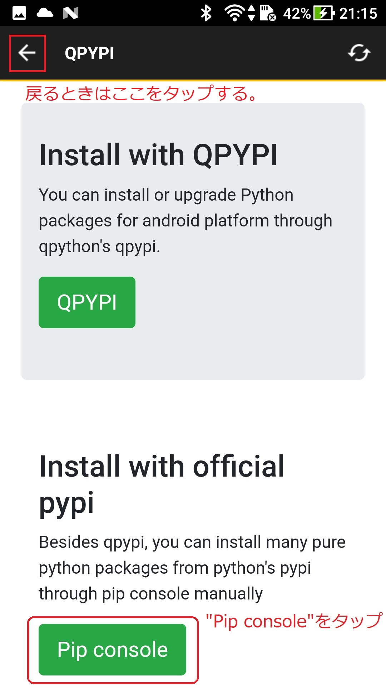

③Terminalが起動するので以下の記述を入れ、仮想キーボードのEnterをタップする。

`pip3 install requests bs4`

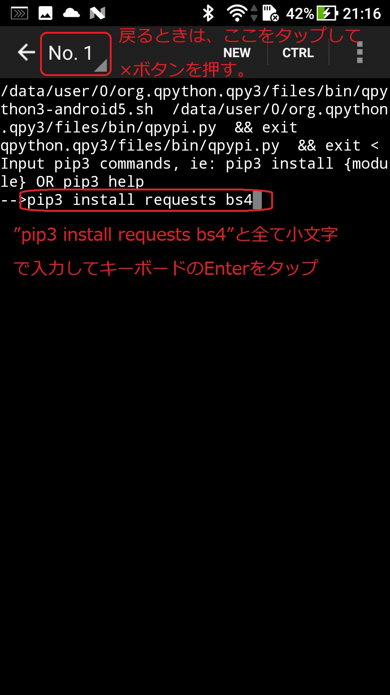

これにより、モジュールのインストールが開始される。少し待つと文字列が流れはじめる。

インストールが終了すると"-->"が最終行に表示される。

インストールの完了後、上記図の"戻るとき"を参考にしてQPythonの起動画面まで戻る。
※QPython起動画面への戻り方
上部の"No1"と記載がある部分をタップすると"No1___×"と表示が出るので、×をタップするとQPYPIの画面まで戻るので、上部の"←"ボタンを押してアプリ起動時の画面まで戻る。

### 3. プログラムファイルの作成と、内容のコピーペースト

導入手順

①上記GoogleDriveからプログラムをダウンロードする。

[INXerTool GoogleDriveダウンロードリンク](https://drive.google.com/file/d/1fXTfbHhst0biVIf3xuBGsAt-e2pAXre0/view?usp=sharing)

上記リンクを開くと、以下のようなINXerTool.pyのソースコードが表示されます。

次に、右上の3点リーダをタップし、メニューから”ダウンロード”をタップする。

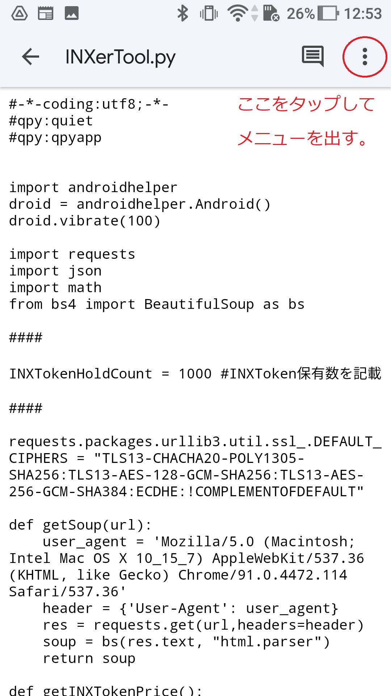
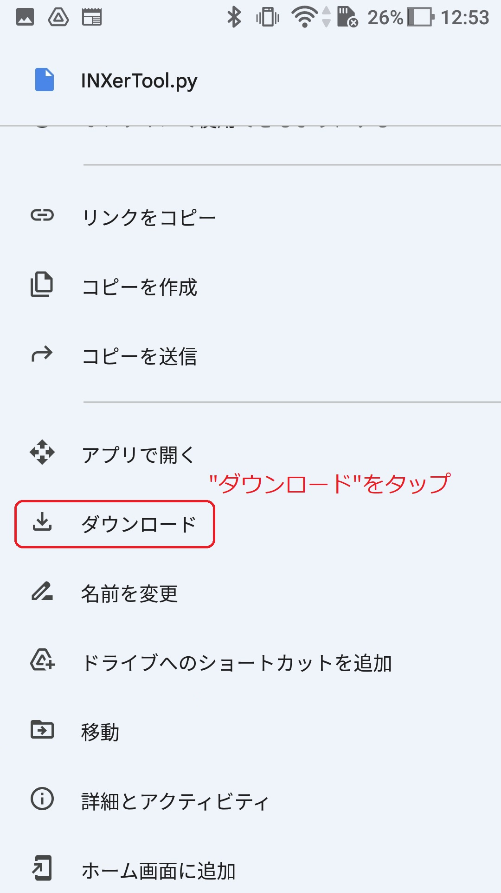

③ファイルマネージャーを利用して"INXerTool.py"を内部ストレージ/qpython/scripts3へ移動させる。

この項では、ファイルマネージャを利用した事が無い方向けに、Google謹製のファイルマネージャである"File by Google"を利用した場合の手順を示します。

>ダウンロードしたファイルをQPythonが読み込める場所へ移動することが目的ですので、普段利用しているファイルマネージャがあれば、それを利用頂いて問題ありません。

["File by Google" GooglePlayStoreへのリンク](https://play.google.com/store/apps/details?id=com.google.android.apps.nbu.files)

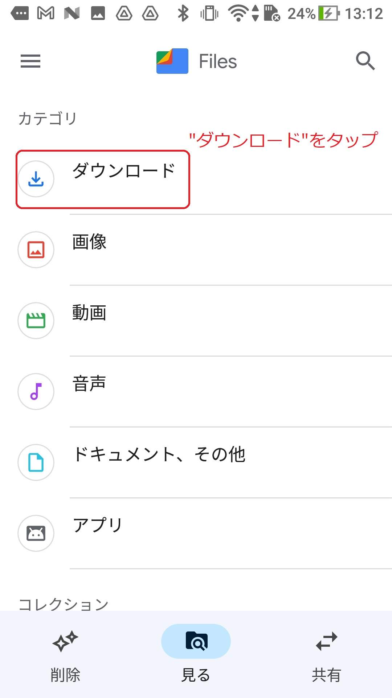
<!-- 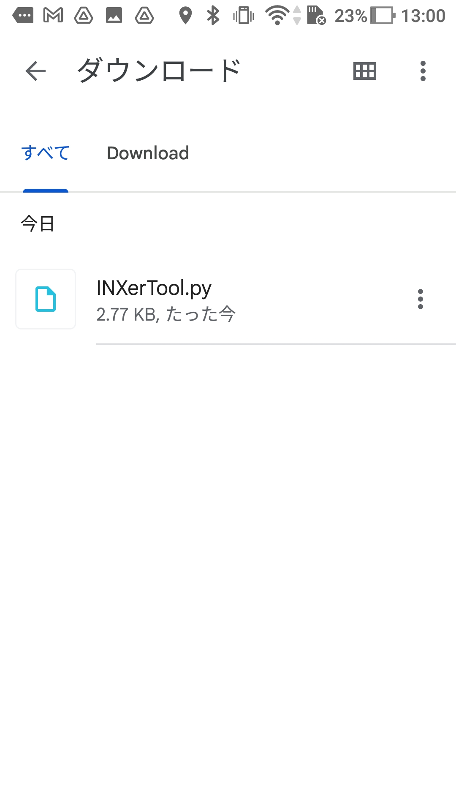 -->
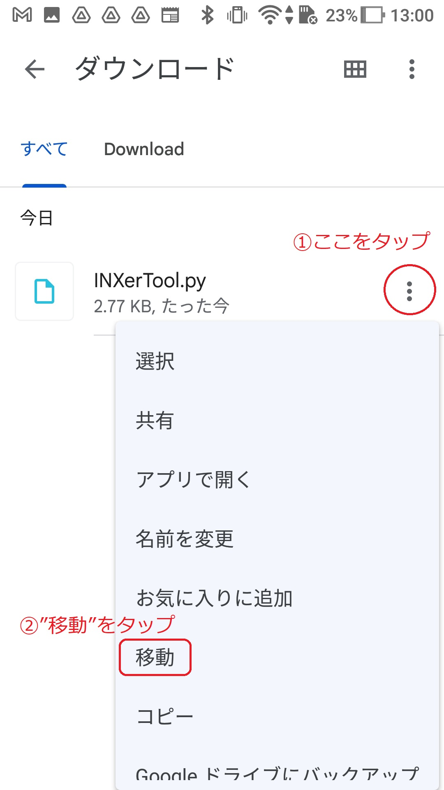

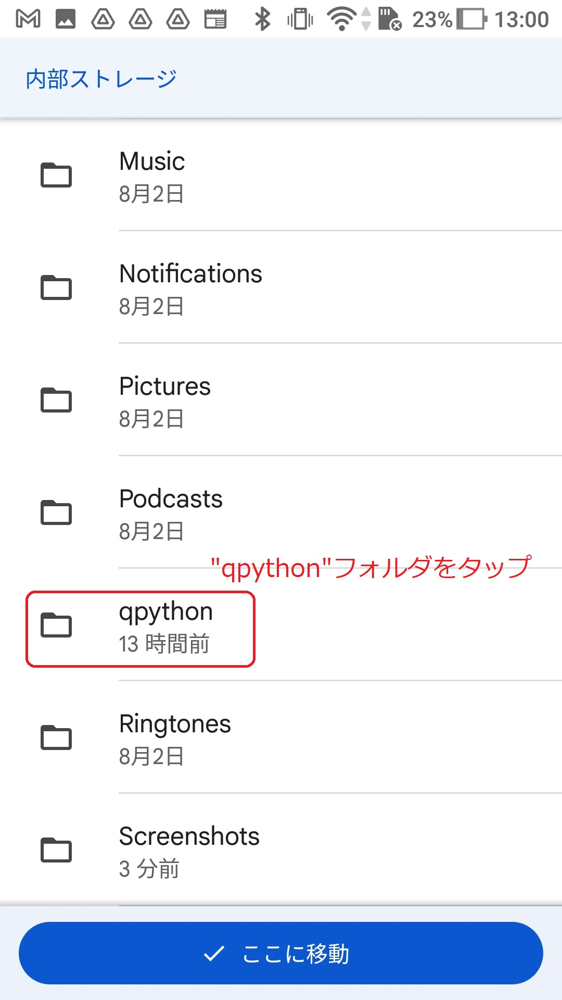
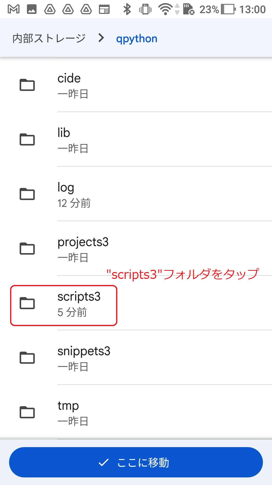
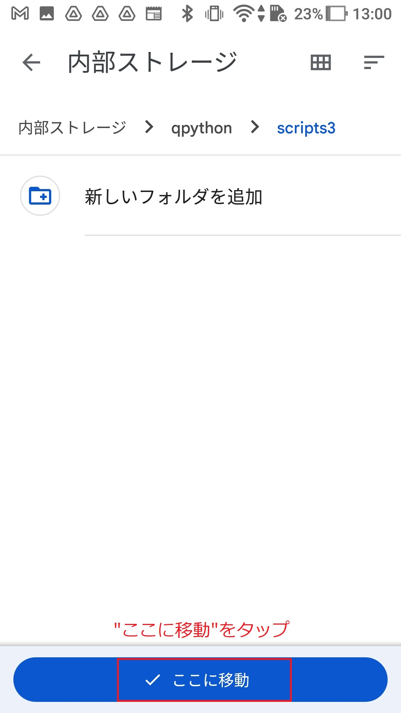

### 4. ホーム画面ショートカットの作成
- 名前を長押し。

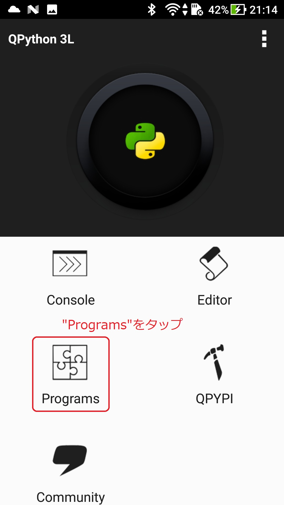
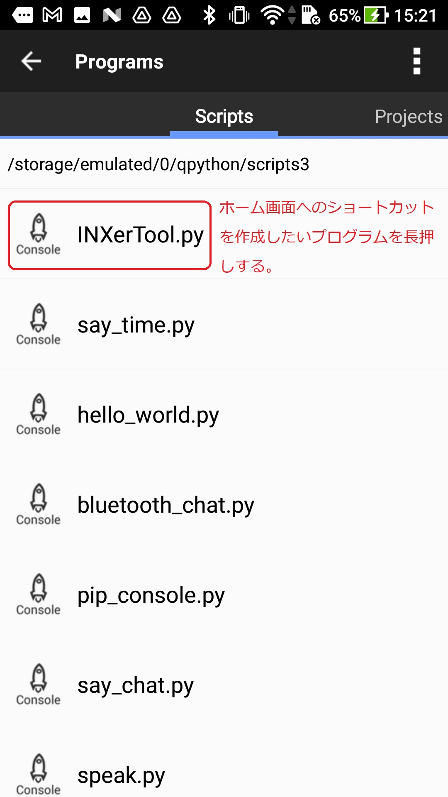
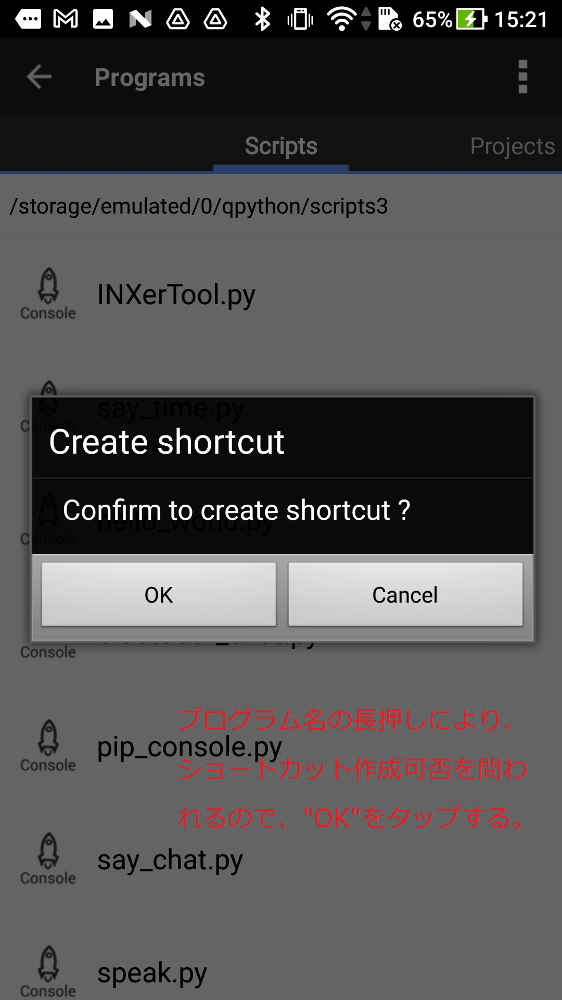

### 5. プログラム動作前準備・注意点
- 上記実施後、タスクマネージャーからQpython 3Lを必ず終了してください。

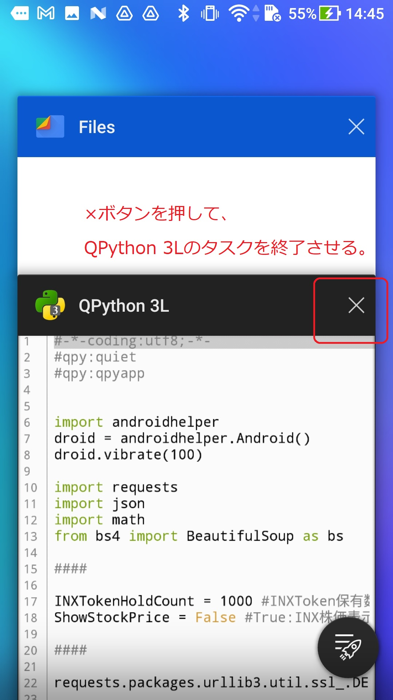

- 一度目はアイコンを2回タップしてください。以降は1度で問題ありません。

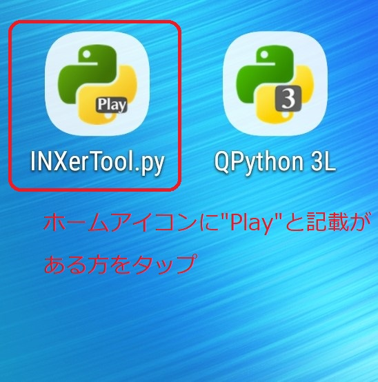

- タップ後、2秒程度で一度振動し、数秒後に結果表示と合わせて再度振動します。一度目の振動が無ければ再度タップしてください。