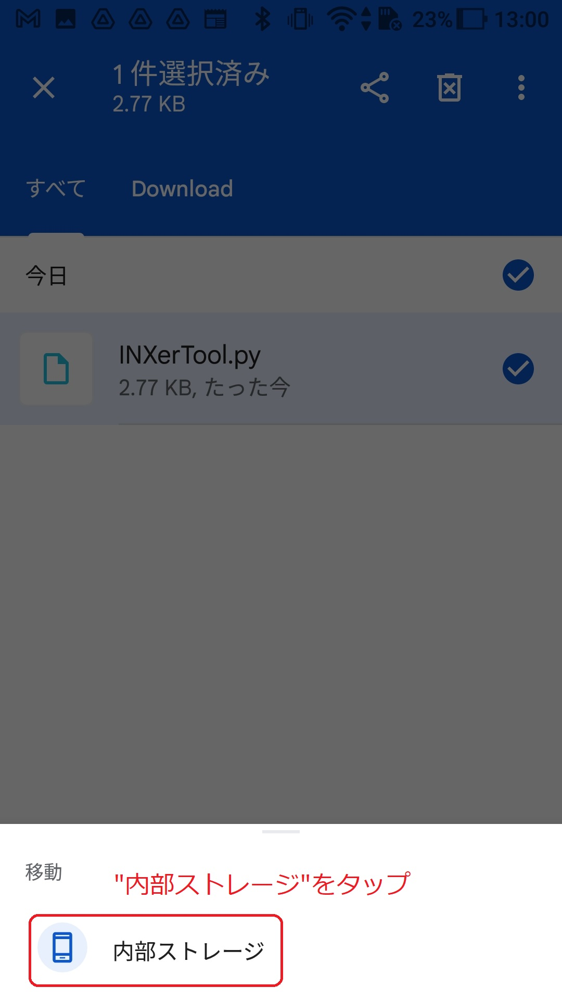

# INXerToolの導入方法と使い方

## 初めに
本ツールは、soutenがINXの価格が気になって気になって仕方がない欲求を少しでも早く満たすために趣味で開発しました。INXerの同志達が少しでも快適なHodler生活の助けになればと思い公開します。

## 注意事項
- 本ツールの利用については、完全自己責任でお願いします。
- 本ツールの利用によって生じたいかなる損害も責任を負いません。
- 導入のハードルが少し高いですが、質問をする前に必ず本ページを熟読してください。
- あくまで"趣味"の範囲ですので、必ずしもすべての質問に答えられるわけではありません。
- クレームや問題が発生した場合は、即公開を停止します。
- INXトークン価格は実行タイミングによっては最新価格でない場合があります。
  ※公式のAPIが出たら更新する予定です。

>最新価格でない場合があるのは、価格情報取得用の機能がINX側で準備されていないため、やむおえず https://www.inx.co/inx-token での価格を参照しているためです。どなたか、QPythonで動的サイト https://one.inx.co/trading/INX-USD が読める方法をご存じであれば教えて頂けると幸いです。

## INXerToolの機能について
INXerToolは以下の4つの機能を持っています。
1. INXトークン価格表示機能
2. INXDF株式価格表示機能 ※初期状態無効
3. INXトークン保有数から合計資産価値計算機能 #初期は1000トークン
4. USDJPY取得機能

## 動作確認環境
- Android OS 7.1.1 (Zenfone3 Lazer)

  ※これ以外の機器で動作確認はできていませんので、利用できたOSのバージョンをTwitterのリプライ等で教えてもらえると嬉しいです。

## 利用するソフトウェア
- QPython 3L (Google play store)

  ※AndroidでPythonコードを実行できる環境が無料で整う素晴らしいソフトです。いろいろ試した中でも、"無料", "ホーム画面にショートカットを置ける"という点で十分な機能を持っているので、利用させて頂きました。

## 導入が必要なプラグイン
- requests : webサイトからのデータ取得用
- beautifulsoup4 : webデータの構文解析用

## 導入方法
以下に示す1~6のステップに沿って導入してください。

[Step1. QPython 3Lのダウンロード](#1-qpython-3lのダウンロード) 
[Step2. プログラム必須ライブラリの導入](#2-プログラム必須ライブラリの導入) 
[Step3. プログラムファイルのダウンロードとPQythonフォルダへの移動](#3-プログラムファイルのダウンロードとqpythonフォルダへの移動) 
[Step4. INXトークン保有数とINXDF株価表示機能](#4-inxトークン保有数とinxdf株価表示機能) 
[Step5. ホーム画面ショートカットの作成](#5-ホーム画面ショートカットの作成) 
[Step6. プログラムの動作準備と注意点](#6-プログラム動作前準備と注意点) 

### 1. QPython 3Lのダウンロード
["QPython 3L" GooglePlayStoreへのリンク](https://play.google.com/store/apps/details?id=org.qpython.qpy3)

### 2. プログラム必須ライブラリの導入
ここでは、INXerToolを利用する上で必須のPythonライブラリの導入を行います。

①QPython 3Lのメイン画面にて、QPYPIボタンを押しQPYPIの画面を表示させる。

②"Install with official pypi"をタップする。

③Terminalが起動するので以下の記述を入れ、仮想キーボードのEnterをタップする。

`pip3 install requests bs4`

少し待つとダウンロードとインストールが始まるので終了まで待つ。 

>インストールが終了すると"-->"が最終行に表示される。

インストールの完了後、上記図の"戻るとき"を参考にしてQPythonの起動画面まで戻る。
※QPython起動画面への戻り方
上部の"No1"と記載がある部分をタップすると"No1___×"と表示が出るので、×をタップするとQPYPIの画面まで戻るので、上部の"←"ボタンを押してアプリ起動時の画面まで戻る。

### 3. プログラムファイルのダウンロードと、QPythonフォルダへの移動
ここでは、INXerToolのソースコードダウンロードとQPythonで実行するためにファイルの移動を行います。

①GoogleDriveからINXerToolをダウンロードする。

[INXerTool GoogleDriveダウンロードリンク](https://drive.google.com/file/d/1fXTfbHhst0biVIf3xuBGsAt-e2pAXre0/view?usp=sharing)

上記リンクを開くと、以下のようなINXerTool.pyのソースコードが表示されます。

②右上の3点リーダをタップし、メニューから”ダウンロード”をタップする。

③ダウンロードしたファイルを、ファイルマネージャーを利用して内部ストレージ/qpython/scripts3へ移動させる。

これ以降では、ファイルマネージャを利用した事が無い方向けに、Google謹製のファイルマネージャである"File by Google"を利用した場合の手順を示します。

>ダウンロードしたファイルをQPythonが読み込める場所へ移動することが目的ですので、普段利用しているファイルマネージャがあれば、それを利用頂いて問題ありません。なお、File by Google以外のファイルマネージャの使い方はサポートしません。

③-1 以下のリンクをクリックしてFile by Googleをダウンロードする。

["File by Google" GooglePlayStoreへのリンク](https://play.google.com/store/apps/details?id=com.google.android.apps.nbu.files)

③-2 Fileを起動したら、"ダウンロード"フォルダをタップする。

<!--  -->

③-3 ダウンロードフォルダ内の"INXerTool.py"の右上の三点リーダーをタップ後、メニューが出てくるので、"移動"をタップする。

③-4 "内部ストレージ"をタップする。

③-5 "qpython"をタップ

③-6 "scripts3"をタップ

③-7 "ここに移動"をタップ

以上で移動完了です。

### 4. INXトークン保有数とINXDF株価表示機能
INXerToolでは、INXトークンの保有数を事前に入力しておくと、資産価値を日本円で計算する機能があります。
> 特に変更しない場合は、1000トークンが初期値として記載されています。
また、INXの株式であるINXDF株式の価格表示機能も有しておりますが、処理時間が増加するため、初期では無効化してあります。

①QPythonの起動画面でEditorをタップする。

②INXerTool.pyをタップし、"→"をタップする。

③トークン保有数と株式表示の有無を設定する。
トークン保有数は、画面左側行数で6行目の数字を変更することで更新が可能です。また、7行目の"False"を"True"に変更することで、INDFの表示機能が有効となります。
>上記変更後は、必ず下部の保存ボタンを押して変更を適用してください。押さない場合は何度変更しても適用されません。

### 5. ホーム画面ショートカットの作成
ここでは、普段使用する度にQPythonを開くという煩雑な作業を無くすため、ホーム画面にプログラムをワンタップで起動可能なショートカットを作成する手順を示す。

①QPythonの起動画面から、"Programs"をタップする。

②後にホーム画面にショートカットを作成したいプログラムを長押しする。

"OK"を押すことでホーム画面にショートカットを作成できる。

### 6. プログラム動作前準備と注意点
1~5までを完了後、プログラムを起動する前の準備と注意点を以下に示す。

◆実行前の準備

ホーム画面に作成した、プログラム実行用のショートカットは、QPythonが起動していると実行できないため、QPythonを開いた後に"必ず"タスクマネージャーからQpython 3Lを終了してください。終了方法としては、タスクマネージャを開いて、QPython 3Lのウィンドウ右上の×ボタンを押す事でアプリを終了することができます。

◆実行時の注意点

QPythonをバックグラウンドで起動するため、初めて起動する場合は、2回タップしてください。それ以降でも、起動しない場合は2回タップすることで起動する場合がありますので注意ください。
>アプリが起動した場合は、タップ後に2秒程度で一度振動し、数秒後に結果表示と合わせて再度振動します。一度目の振動が無ければ再度タップしてください。

◆起動画面

以上で導入は終わりです。お疲れさまでした。
良いHodlerライフを!!

souten
